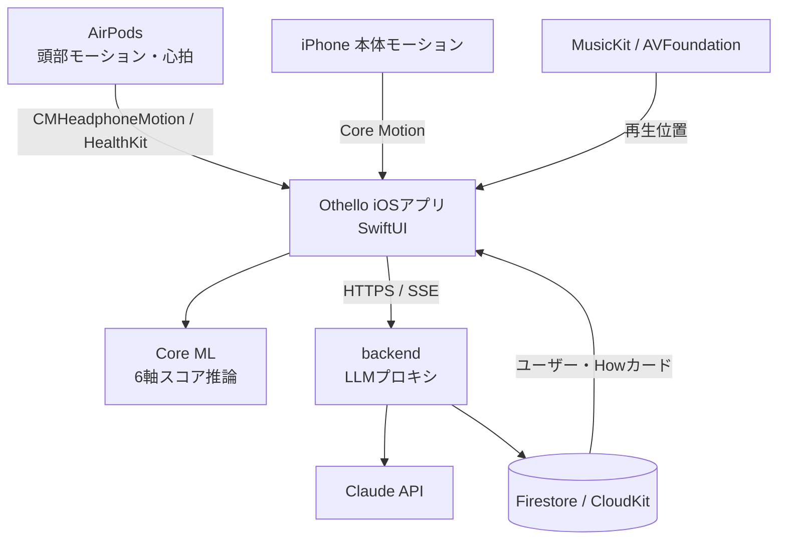
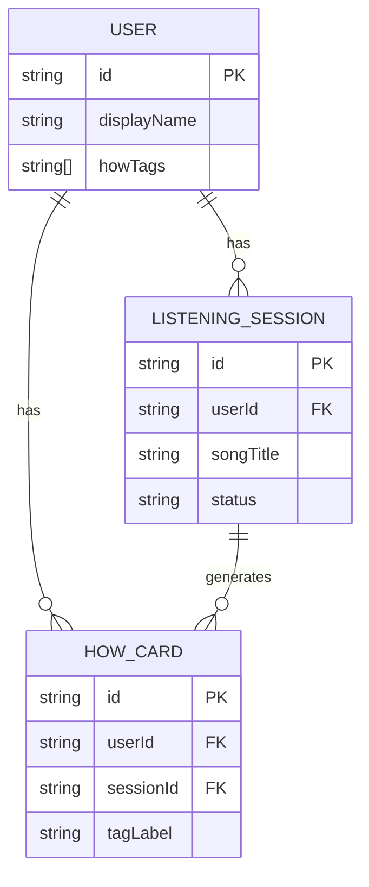
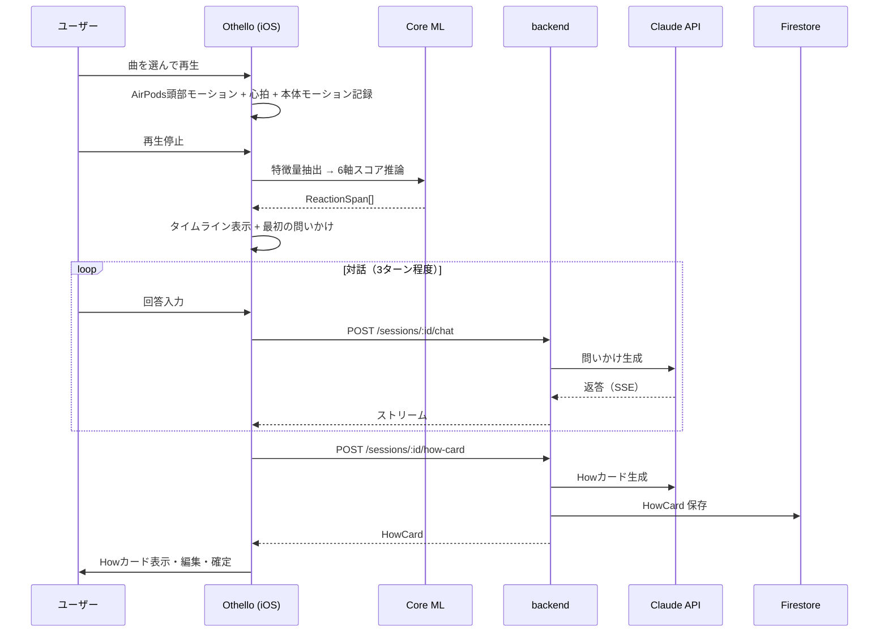
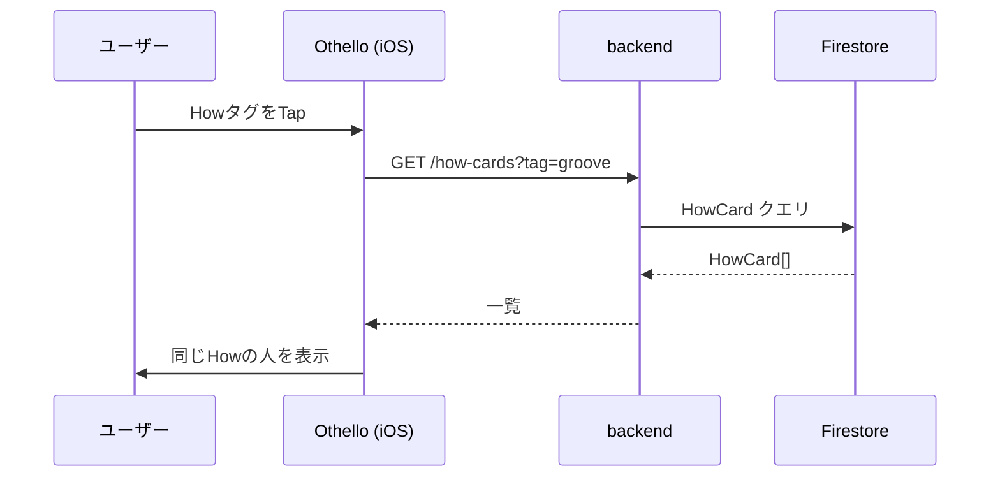
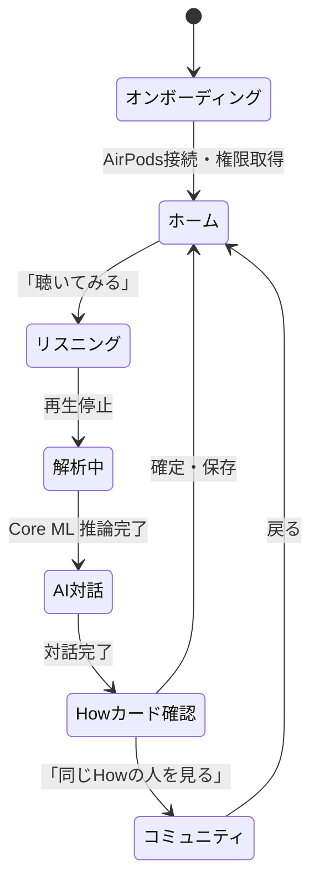

# 機能設計書 (Functional Design Document)

> 対象: **iOS ネイティブ（SwiftUI）**。実コード: `Othello/`（iOSアプリ）/ `backend/` / `ai-recognition/`。

## システム構成図



---

---

## データモデル定義（Swift）

### User

```swift
struct User: Codable, Identifiable {
    let id: String            // 認証 UID
    var displayName: String
    var howTags: [String]     // 蓄積された Howタグ
    var createdAt: Date
}
```

### ListeningSession

```swift
struct ListeningSession: Codable, Identifiable {
    let id: String
    let userId: String
    var songTitle: String
    var durationSec: Double
    var motionFrames: [MotionFrame]   // 本体 + 頭部モーション
    var heartRateSamples: [HeartRateSample]
    var reactions: [ReactionSpan]
    var status: SessionStatus
    var createdAt: Date
}

enum SessionStatus: String, Codable {
    case recording, analyzing, done
}

struct MotionFrame: Codable {
    let t: Double          // 曲中時刻（秒）
    let source: MotionSource  // .device or .headphone
    let ax, ay, az: Double // 加速度
    let magnitude: Double   // 合成
}

enum MotionSource: String, Codable { case device, headphone }

struct HeartRateSample: Codable {
    let t: Double          // 曲中時刻（秒）
    let bpm: Double
    let hrv: Double?       // 心拍変動（取得可能な場合）
}
```

### ReactionSpan / ListeningStateScores

```swift
struct ReactionSpan: Codable {
    let startSec: Double
    let endSec: Double
    let scores: ListeningStateScores
}

struct ListeningStateScores: Codable {
    let groove, hype, chill, immersion, hit, afterglow: Double  // 各 0〜1
}
```

### HowCard

```swift
struct HowCard: Codable, Identifiable {
    let id: String
    let userId: String
    let sessionId: String
    var songTitle: String
    var howTags: [String]      // 例: ["groove", "bass-driven"]
    var tagLabel: String       // 例: "ベースの入りに反応する人"
    var description: String     // 2〜3文
    var highlightSec: Double    // 代表的な反応地点
    var createdAt: Date
}
```

### ER図



---

## コンポーネント設計（iOS Service）

### HeadphoneMotionService
**責務**: `CMHeadphoneMotionManager` で AirPods 頭部モーションを取得・時刻同期

```swift
protocol HeadphoneMotionService {
    var isConnected: Bool { get }
    func start(onFrame: @escaping (MotionFrame) -> Void)
    func stop()
}
```

### DeviceMotionService
**責務**: Core Motion で iPhone 本体モーションを取得（AirPods 非接続時のフォールバック）

### HeartRateService
**責務**: HealthKit で心拍を取得し曲中時刻に対応づけ

```swift
protocol HeartRateService {
    func requestAuthorization() async throws
    func start(onSample: @escaping (HeartRateSample) -> Void)
    func stop()
}
```

### PlayerService
**責務**: MusicKit / AVFoundation で再生し、再生位置を供給

### ReactionClassifier
**責務**: 特徴量を Core ML モデルに入力し6軸スコアを推論

```swift
struct ReactionClassifier {
    func extractFeatures(_ frames: [MotionFrame], _ hr: [HeartRateSample], windowSec: Double) -> [FeatureVector]
    func classify(_ features: [FeatureVector]) -> [ListeningStateScores]
}
```

### APIClient
**責務**: backend との HTTP/SSE 通信（セッション保存・対話・Howカード生成）

---

## ユースケース図

### UC-01: 曲を聴いて Howカードを作る（メインフロー）



### UC-02: 同じHowの人を探す



---

## 画面遷移図



---

## API 設計（backend）

### POST /sessions — セッション保存・解析結果保存
推論は端末（Core ML）で行うため、リクエストは反応区間を含む。

```json
{
  "songTitle": "Blinding Lights",
  "durationSec": 200,
  "reactions": [
    { "startSec": 78, "endSec": 84,
      "scores": { "groove": 0.82, "hype": 0.31, "chill": 0.05, "immersion": 0.12, "hit": 0.44, "afterglow": 0.08 } }
  ]
}
```

### POST /sessions/:id/chat — AI 対話（SSE）

```json
{ "message": "ベースが入った瞬間が好きだった" }
```
レスポンスは Server-Sent Events で逐次返却。

### POST /sessions/:id/how-card — Howカード生成

```json
{
  "howCard": {
    "howTags": ["groove", "bass-driven"],
    "tagLabel": "ベースの入りに反応する人",
    "description": "メロディより先に、低音の重心やリズムの入り方に反応するタイプ。",
    "highlightSec": 78
  }
}
```

### GET /how-cards?tag=groove — Howカード一覧

---

## アルゴリズム設計: 6軸聴取状態スコア

### 目的
1〜3秒窓のモーション+心拍特徴量から6軸スコアを推定する。

### 特徴量

| 特徴量 | 説明 |
|--------|------|
| meanMagnitude / stdMagnitude | 動き量・ばらつき |
| maxDelta | 最大変化量（スパイク検出） |
| energy | 運動エネルギー |
| peakCount / rhythmRegularity | リズム周期・規則性 |
| stillness | 静止度 |
| heartRate / hrvTrend | 心拍数・心拍変動トレンド（生理的高揚の裏付け） |

### 推論
- MVP 初期: ルールベース（`ai-recognition/` でルール定義）
- 学習後: TensorFlow で学習 → Core ML 変換 → `ReactionClassifier` で端末推論
- 心拍はトレンド（上昇/下降/安定）として扱い、秒単位の断定をしない

---

## UI設計

### Howカード

```
┌─────────────────────────────────────┐
│  🎵 Blinding Lights                 │
│  ベースの入りに反応する人           │
│  メロディより先に、低音の重心やリズム │
│  の入り方に反応するタイプ。          │
│  [groove] [bass-driven]  📍 1:18    │
│  [編集] [シェア] [同じHowの人を見る] │
└─────────────────────────────────────┘
```

### タイムライン
- 横軸: 再生時間
- 6スコアをカラーで重ね描画（Groove=緑/Hype=赤/Chill=青/Immersion=紫/Hit=橙/Afterglow=水）
- 心拍トレンドを別レーンで重ねる

---

## エラーハンドリング

| エラー | 処理 | ユーザー表示 |
|--------|------|-------------|
| AirPods 未接続 | 本体モーションへフォールバック | 「AirPods が無いので iPhone の動きで記録します」 |
| モーション/ヘルス権限拒否 | 手動ラベルモードへ | 「手動で反応を記録できます」 |
| 心拍非対応機種 | 心拍機能を無効化 | （通知最小） |
| LLM 障害 | リトライ→デフォルト質問 | 「もう少し教えてください。どこが好きでしたか？」 |
| 通信断 | ローカルバッファ→再送 | （透過処理） |

---

## テスト戦略

### ユニットテスト（XCTest）
- 特徴量抽出: 既知のモーションパターンで値域を確認
- `ReactionClassifier`: 静止・一定リズム・スパイクのエッジケース
- センサー Service: プロトコル抽象化してモック注入

### 統合テスト
- backend: Claude API をモックして対話・カード生成フロー

### E2E（手動）
- 実機（iPhone + AirPods）: 接続 → 再生 → モーション/心拍 → AI 対話 → Howカード
