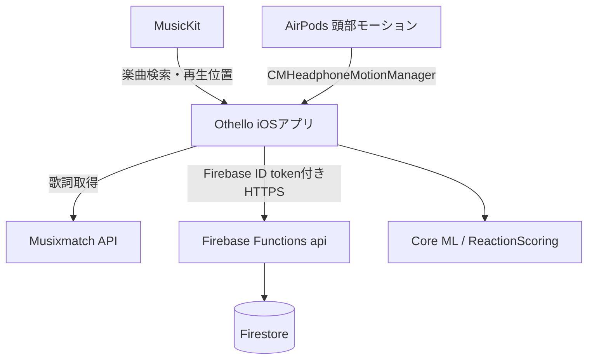
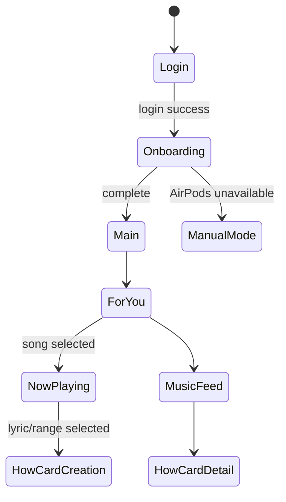

# 機能設計書 (Functional Design Document)

> 2026-05-25 時点の実装に追従する。対象は iOS ネイティブアプリ `Othello/` と Firebase Functions `functions/`。

## システム構成



HealthKit / 心拍連携は現行実装から削除済み。

---

## 主要機能

### 認証

- Firebase Auth でログイン状態を管理する。
- 未ログイン時は `LoginView` を表示する。
- ログイン後、オンボーディング完了状態に応じてメイン画面へ進む。

### オンボーディング

- Apple Music 認証と契約状態を確認する。
- Apple Music のカタログ再生ができない場合は、契約が必要であることを表示する。
- AirPods 頭部モーションが利用可能か確認する。
- 利用できない場合は手動モードへ進める。
- HealthKit 権限は要求しない。

### 再生

- `MusicKitPlaybackService` が MusicKit 認証、曲検索、再生、一時停止、再生位置更新を担う。
- 再生位置が取得できない場合は alert を表示する。
- `PlaybackPositionProviding` を通じて AirPods モーションのサンプルに曲中時刻を紐づける。

### 頭部モーション取得

- `AirPodsMotionManager` が `CMHeadphoneMotionManager` から加速度・回転速度・姿勢を取得する。
- サンプルは `AirPodsMotionSample` として扱う。
- AirPods が未接続・非対応の場合は status と event で UI に通知する。

### 反応検出

- `ReactionFeatureExtractor` が 2秒窓で特徴量を抽出する。
- 特徴量:
  - `meanMagnitude`
  - `stdMagnitude`
  - `maxDelta`
  - `energy`
  - `peakCount`
  - `rhythmRegularity`
  - `stillness`
- `OthelloActivityClassifierService` が Core ML モデルを読み込める場合は補助推論する。
- `ReactionScoringService` が `groove / chill / neutral` の3状態スコアへ変換する。

### 歌詞表示

- `MusixmatchLyricsProvider` が MusicKit の曲名・アーティスト名・アルバム名・ISRC・曲長を使って Musixmatch と照合する。
- `matcher.track.get` で track を解決する。
- `track.subtitle.get` で LRC 形式の同期歌詞を試す。
- 同期歌詞が取れない場合は `track.lyrics.get` の静的歌詞へ fallback する。
- 歌詞取得できない場合も、歌詞なし表示で体験を継続する。

### Howカードコメント

- 曲中区間に対して `comment`, `song_start`, `song_end`, `song_id`, `artist_id` を保存する。
- 保存・取得・更新・いいねは Functions の `/how-cards` API を使う。
- NowPlaying の歌詞行をタップすると、その歌詞を起点に感想を投稿できる。同期歌詞では歌詞行の時刻を `song_start` / `song_end` に使い、静的歌詞では行ごとの文字数比から曲内範囲を推定する。
- `user_name` は Functions が `users/{user_id}.display_name` から補完する。

### コミュニティ / フィード

- Howカードコメント一覧を表示する。
- 曲単位では `GET /how-cards?song_id=...` を使う。
- `GET /how-cards?tag=...` は現行 Functions には未実装。

### HowChat

- `HowChatView` / `HowChatViewModel` / `ChatAPIClient` は残っている。
- `HOWTUNE_CHAT_MOCK=true` または DEBUG で base URL がない場合は mock 応答を使う。
- 非 mock 時の `/sessions/default/chat` と `/sessions/demo/how-card` は legacy endpoint であり、現行 Functions 本番には実装されていない。

---

## データモデル（Swift）

### ReactionScore

```swift
struct ReactionScore {
    var groove: Double
    var chill: Double
    var neutral: Double
}
```

### ReactionEvent

```swift
struct ReactionEvent: Identifiable {
    let id: UUID
    let startTime: TimeInterval
    let endTime: TimeInterval
    let intensity: Double
    let tags: [HowTag]
    let lyricLine: String?
    let lyricTranslation: String?
    let heartRateTrend: HeartRateTrend
}
```

`heartRateTrend` は legacy 表示互換のフィールドであり、現行実装では実測心拍に基づかない。

### HowCardComment

Functions API と対応するコメントモデル。

```text
id / documentID
comment
song_start
song_end
song_id
artist_id
user_id
user_name
goods / likes
created_at
updated_at
```

---

## API 設計

Base URL:

```text
https://asia-northeast1-egh-howtune.cloudfunctions.net/api
```

| Method | Path | 用途 |
|---|---|---|
| GET | `/health` | 死活確認 |
| GET | `/how-cards` | 最新 Howカードコメント一覧 |
| GET | `/how-cards?song_id=...` | 曲ごとの Howカードコメント一覧 |
| GET | `/how-cards/:id` | Howカードコメント詳細 |
| POST | `/how-cards` | Howカードコメント作成 |
| PATCH | `/how-cards/:id` | 自分の Howカードコメント更新 |
| POST | `/how-cards/:id/like` | いいね |
| GET | `/users/me` | 自分のユーザー情報取得 |
| PUT | `/users/me` | 自分のユーザー情報作成・更新 |

すべての API は `/health` を除いて Firebase ID token が必要。

---

## 画面遷移



現行 `ContentView` の main は `ForYouView` を中心に表示し、曲選択後は mini player と `NowPlayingView` を開く。

---

## エラーハンドリング

| エラー | 処理 |
|---|---|
| Firebase 未ログイン | LoginView へ |
| MusicKit 未許可 | 再生位置不可の alert または検索空状態 |
| Apple Music 未契約 | 契約が必要であることをオンボーディング・メイン画面・検索空状態に表示 |
| AirPods 未接続 / 非対応 | 手動モードまたは取得停止表示 |
| Musixmatch 同期歌詞なし | 静的歌詞へ fallback |
| Musixmatch 歌詞なし | 歌詞なし表示 |
| Functions 401/403 | 認証エラーとして扱う |
| Functions 404 | document not found として扱う |

---

## テスト観点

- MusicKit 認証後に検索・再生・再生位置更新が動く。
- AirPods 接続時に頭部モーションサンプルが入り、3状態スコアが更新される。
- Musixmatch の同期歌詞取得と静的歌詞 fallback が動く。
- `POST /how-cards` / `GET /how-cards` / `POST /how-cards/:id/like` が Firebase ID token 付きで動く。
- `HOWTUNE_CHAT_MOCK=true` で HowChat が API 未接続でも進行する。
