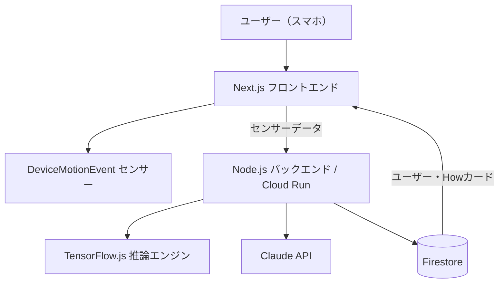
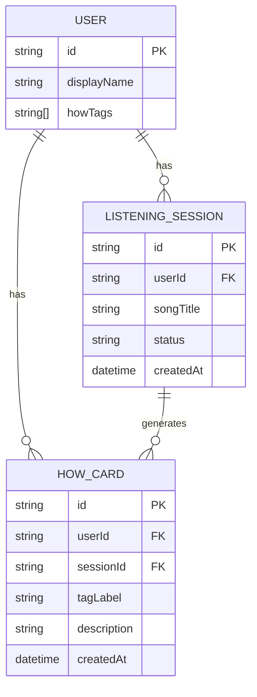
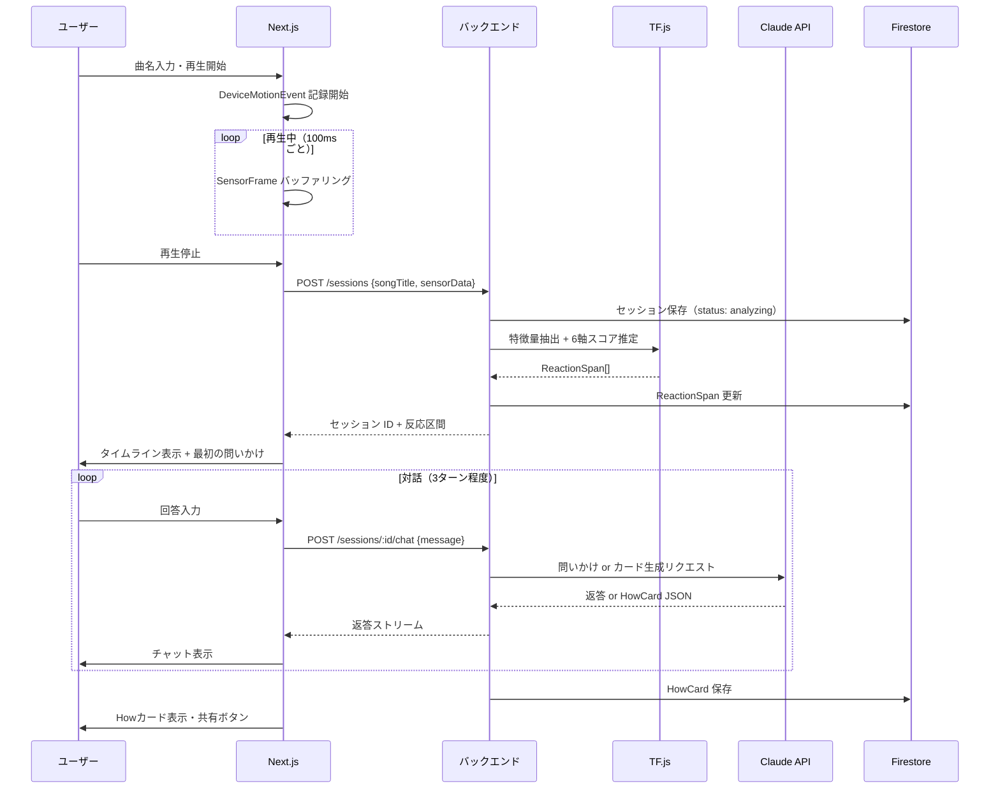
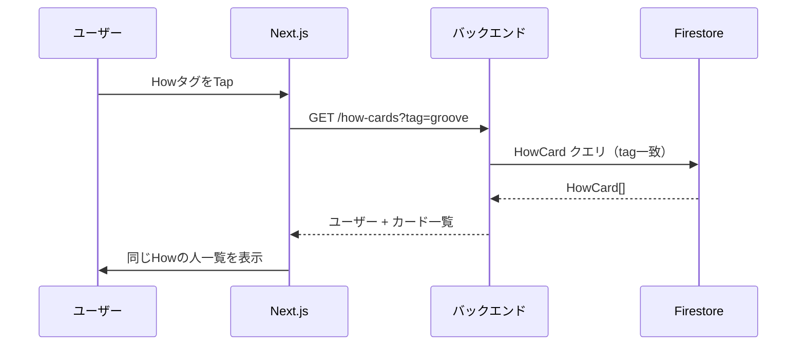

# 機能設計書 (Functional Design Document)

## システム構成図



---

## 技術スタック

| 分類 | 技術 | 選定理由 |
|------|------|----------|
| フロントエンド | Next.js (App Router) | SSRとCSRの両立。DeviceMotionEvent はクライアント側で動作 |
| バックエンド | Node.js (Express) on Cloud Run | サーバーレスでスケール可能。TensorFlow.js-node が動作する環境 |
| ML | TensorFlow.js / @tensorflow/tfjs-node | ブラウザ・Node.js 両方で動作。追加インフラ不要 |
| LLM | Claude API (claude-sonnet-4-6) | 問いかけ型の自然な対話生成に強み |
| データベース | Firestore | リアルタイム性、スキーマレス、Cloud Run との相性 |
| ストレージ | Cloud Storage | 教師データ（JSONL）の保存 |
| 認証 | Firebase Auth (Google OAuth) | 最小実装でユーザー管理 |

---

## データモデル定義

### エンティティ: User

```typescript
interface User {
  id: string;           // Firebase Auth UID
  displayName: string;  // 表示名
  howTags: string[];    // 蓄積されたHowタグ一覧
  createdAt: Date;
  updatedAt: Date;
}
```

---

### エンティティ: ListeningSession

```typescript
interface ListeningSession {
  id: string;               // UUID
  userId: string;           // FK -> User
  songTitle: string;        // 曲名（ユーザー入力）
  durationSec: number;      // 再生時間（秒）
  sensorData: SensorFrame[]; // 加速度データ列
  reactions: ReactionSpan[]; // 検出された反応区間
  status: 'recording' | 'analyzing' | 'done';
  createdAt: Date;
}

interface SensorFrame {
  t: number;   // 曲中タイムスタンプ（ms）
  x: number;   // x軸加速度
  y: number;   // y軸加速度
  z: number;   // z軸加速度
  mag: number; // 合成加速度 sqrt(x²+y²+z²)
}

interface ReactionSpan {
  startMs: number;
  endMs: number;
  scores: ListeningStateScores; // 6軸スコア
}

interface ListeningStateScores {
  groove: number;     // 0〜1
  hype: number;
  chill: number;
  immersion: number;
  hit: number;
  afterglow: number;
}
```

---

### エンティティ: HowCard

```typescript
interface HowCard {
  id: string;
  userId: string;             // FK -> User
  sessionId: string;          // FK -> ListeningSession
  songTitle: string;
  howTags: string[];          // 例: ["groove", "bass-driven"]
  tagLabel: string;           // 例: "ベースの入りに反応する人"
  description: string;        // 2〜3文の説明
  highlightMs: number;        // 代表的な反応地点
  shareImageUrl?: string;     // OGP用画像URL
  createdAt: Date;
}
```

---

### ER図



---

## コンポーネント設計

### フロントエンド

#### SensorRecorder
**責務**: DeviceMotionEvent からセンサーデータを取得・バッファリング

```typescript
class SensorRecorder {
  start(): void;                       // 記録開始（センサー許可を含む）
  stop(): SensorFrame[];               // 記録停止・データ返却
  onFrame(cb: (f: SensorFrame) => void): void; // リアルタイムコールバック
}
```

#### ReactionVisualizer
**責務**: タイムライン上に反応区間とスコアを描画

```typescript
interface ReactionVisualizerProps {
  duration: number;
  reactions: ReactionSpan[];
  currentTime: number;
}
```

#### HowChatDialog
**責務**: AI との対話 UI。ターン管理とストリーミング表示

```typescript
interface ChatTurn {
  role: 'ai' | 'user';
  content: string;
}
```

---

### バックエンド

#### MotionAnalyzer
**責務**: センサーデータから特徴量を抽出し、TensorFlow.js モデルでスコアを推定

```typescript
class MotionAnalyzer {
  extractFeatures(frames: SensorFrame[], windowMs: number): FeatureVector[];
  classify(features: FeatureVector[]): ListeningStateScores[];
}
```

#### HowDialogOrchestrator
**責務**: 反応区間情報を受け取り、Claude API で対話を進行し Howカードを生成

```typescript
class HowDialogOrchestrator {
  generateQuestion(reaction: ReactionSpan, songTitle: string): Promise<string>;
  processAnswer(answer: string, history: ChatTurn[]): Promise<ChatTurn>;
  generateHowCard(history: ChatTurn[], sessionId: string): Promise<HowCard>;
}
```

---

## ユースケース図

### UC-01: 曲を聴いてHowカードを作る（メインフロー）



---

### UC-02: 同じHowの人を探す



---

## 画面遷移図

```mermaid
stateDiagram-v2
    [*] --> ホーム
    ホーム --> リスニング画面: 「聴いてみる」ボタン
    リスニング画面 --> 解析中: 再生停止
    解析中 --> AI対話: 反応区間検出完了
    AI対話 --> Howカード確認: 対話完了（3ターン以上）
    Howカード確認 --> 共有: 「シェアする」
    Howカード確認 --> コミュニティ: 「同じHowの人を見る」
    コミュニティ --> ホーム: 戻る
    共有 --> ホーム: 完了
    ホーム --> プロフィール: マイページ
    プロフィール --> ホーム: 戻る
```



---

## API 設計

### POST /api/sessions — セッション作成・解析

**リクエスト**:
```json
{
  "songTitle": "Blinding Lights",
  "sensorData": [
    { "t": 0, "x": 0.12, "y": -0.03, "z": 9.81, "mag": 9.81 }
  ]
}
```

**レスポンス**:
```json
{
  "sessionId": "uuid",
  "reactions": [
    {
      "startMs": 78000,
      "endMs": 84000,
      "scores": { "groove": 0.82, "hype": 0.31, "chill": 0.05, "immersion": 0.12, "hit": 0.44, "afterglow": 0.08 }
    }
  ],
  "firstQuestion": "1:18あたりで動きが大きくなっていました。リズムに乗っていましたか？"
}
```

---

### POST /api/sessions/:id/chat — AI 対話

**リクエスト**:
```json
{
  "message": "ベースが入った瞬間が好きだった"
}
```

**レスポンス** (Server-Sent Events でストリーミング):
```
data: {"role":"ai","content":"ベースの重心が下がる感じに反応したんですね。"}
data: {"role":"ai","content":"それは「音の重さ」で感じるタイプですか？"}
data: [DONE]
```

---

### POST /api/sessions/:id/how-card — Howカード生成

**リクエスト**:
```json
{
  "chatHistory": [...]
}
```

**レスポンス**:
```json
{
  "howCard": {
    "id": "uuid",
    "howTags": ["groove", "bass-driven"],
    "tagLabel": "ベースの入りに反応する人",
    "description": "メロディより先に、低音の重心やリズムの入り方に反応するタイプ。曲が一段深くなる瞬間に気持ちよさを感じている。",
    "highlightMs": 78000
  }
}
```

**エラーレスポンス**:
- 400: sensorData が空、または chatHistory が2ターン未満
- 503: LLM API 障害（フォールバックメッセージを返す）

---

### GET /api/how-cards — Howカード一覧

```
GET /api/how-cards?tag=groove&limit=20&cursor=xxx
```

**レスポンス**:
```json
{
  "cards": [...],
  "nextCursor": "xxx"
}
```

---

## アルゴリズム設計: MotionReactionClassifier

### 目的
1〜3秒の時間窓のセンサーデータから聴取状態（6軸）のスコアを推定する。

### 特徴量抽出

| 特徴量 | 計算式 | 説明 |
|--------|--------|------|
| meanMagnitude | `mean(mag)` | 平均動き量 |
| stdMagnitude | `std(mag)` | 動きのばらつき |
| maxDelta | `max(|mag[t] - mag[t-1]|)` | 最大変化量 |
| energy | `sum(mag²) / n` | 運動エネルギー |
| peakCount | ピーク数 / 秒 | リズム周期の推定 |
| rhythmRegularity | ピーク間隔の std 逆数 | 規則性（高いほど一定リズム） |
| stillness | `1 / (1 + energy)` | 静止度 |

### 分類ルール（初期実装はルールベース。後にTF.jsモデルに置換）

```typescript
function classifyWindow(f: FeatureVector): ListeningStateScores {
  return {
    groove:     clamp(f.rhythmRegularity * 0.6 + f.meanMagnitude * 0.4),
    hype:       clamp(f.maxDelta * 0.7 + f.energy * 0.3),
    chill:      clamp(f.stillness * 0.5 + (1 - f.stdMagnitude) * 0.5),
    immersion:  clamp(f.stillness * 0.8),
    hit:        clamp(f.maxDelta > 2.0 ? 0.9 : 0),   // スパイク検出
    afterglow:  clamp(prevHigh && f.stillness > 0.7 ? 0.8 : 0),
  };
}
```

---

## UI設計

### Howカード

```
┌─────────────────────────────────────┐
│  🎵 Blinding Lights                 │
│  ────────────────────────────       │
│  ベースの入りに反応する人           │
│                                     │
│  メロディより先に、低音の重心や      │
│  リズムの入り方に反応するタイプ。   │
│  曲が一段深くなる瞬間に気持ちよさ  │
│  を感じている。                     │
│                                     │
│  [groove] [bass-driven]             │
│  ────────────────────────────       │
│  📍 1:18 の瞬間                     │
│  [シェアする] [同じHowの人を見る]   │
└─────────────────────────────────────┘
```

### タイムライン（リスニング結果）

- 横軸: 曲の再生時間
- 縦軸: 6つの状態スコア（カラーコーディング）
  - Groove: 緑
  - Hype: 赤
  - Chill: 青
  - Immersion: 紫
  - Hit: 橙（スパイク表示）
  - Afterglow: 水色

---

## エラーハンドリング

| エラー種別 | 処理 | ユーザーへの表示 |
|-----------|------|-----------------|
| センサー許可拒否 | 記録をスキップ | 「センサーが使えません。手動でタップして反応を記録してください」 |
| LLM API タイムアウト | 3秒でリトライ×2回、失敗時はデフォルト質問 | 「もう少し教えてください。どのあたりが好きでしたか？」 |
| Firestore 書き込み失敗 | ローカルにキャッシュ、バックグラウンドで再試行 | エラー表示なし（透過的に処理） |
| TF.js 推論エラー | ルールベースにフォールバック | ユーザーには通知しない |

---

## テスト戦略

### ユニットテスト
- `extractFeatures()`: 既知の加速度パターンを入力し、特徴量の値域を確認
- `classifyWindow()`: 各状態のエッジケース（静止・急激な動き・一定リズム）

### 統合テスト
- `POST /api/sessions`: ダミーセンサーデータを送り、ReactionSpan が返ることを確認
- `POST /api/sessions/:id/chat`: Claude API のモックを使い、返答フォーマットを確認

### E2E テスト（ハッカソン期間は手動）
- iPhone Safari でセンサー許可 → 曲再生 → AI 対話 → Howカード表示
- Android Chrome で同じフローを確認
