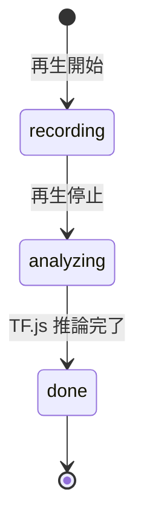

# プロジェクト用語集 (Glossary)

## 概要

HowTune プロジェクト内で使用される用語の定義を管理します。

**更新日**: 2026-05-24

---

## ドメイン用語

### How（ハウ）

**定義**: 音楽の楽しみ方・聴き方の様式。「どのように」聴いているか。

**説明**: 「何を（What）聴くか」（曲名・アーティスト・ジャンル）ではなく、「どのように（How）聴いているか」という軸で音楽体験を表現する概念。HowTune のコアコンセプト。

**関連用語**: Howタグ、Howカード、聴取状態

**使用例**:
- 「ベースラインの入りに反応するのは、グルーヴ型の How を持つリスナー」
- 「同じ曲を How で検索する」

**英語表記**: How（そのまま使用）

---

### Howタグ

**定義**: ユーザーの音楽の楽しみ方を表現した短いラベル文字列。

**説明**: AI対話の結果から生成される、ユーザーの聴き方の特徴を表すキーワード群。ユーザー同士のマッチングに使用される。

**関連用語**: Howカード、聴取状態

**使用例**:
- `groove`（リズムに乗るタイプ）
- `bass-driven`（ベースに反応するタイプ）
- `chill-listener`（穏やかに聴き込むタイプ）
- `drop-hype`（展開で盛り上がるタイプ）

**英語表記**: How Tag

---

### Howカード

**定義**: ユーザー1回のリスニングセッションから生成される、聴き方を可視化したプロフィールカード。

**説明**: センサーデータ解析→AI対話の結果、生成される共有可能なコンテンツ。Howタグ・説明文・代表的な反応地点（タイムスタンプ）を含む。

**関連用語**: Howタグ、リスニングセッション

**使用例**:
- 「Howカードをシェアして、同じ聴き方の人を探す」
- 「自分の Howカードを見直して、音楽の楽しみ方を振り返る」

**英語表記**: How Card

---

### 聴取状態（Listening State）

**定義**: 音楽を聴いているときの身体的・心理的な状態の分類。センサーデータから推定する。

**説明**: 6種類の状態を定義する（詳細は下表）。これらはマルチラベル（同時に複数が成立可能）。

| 状態名 | 英語 | 特徴 | センサーの特徴 |
|--------|------|------|---------------|
| ノリ | Groove | リズムに乗って規則的に揺れている | 一定周期の揺れ、高い rhythmRegularity |
| 高揚 | Hype | サビや展開で急激にテンションが上がる | 急激な加速度増加、高い maxDelta |
| チル | Chill | 穏やかにゆっくりと揺れている | 小さい揺れ、低い energy |
| 没入 | Immersion | 集中して聴いており、ほとんど動かない | 高い stillness |
| 刺さり | Hit | 特定の一瞬（歌詞・音）に短く強く反応する | 短時間のスパイク |
| 余韻 | Afterglow | 盛り上がりの後、静かに余韻に浸っている | 直前の動きが減少 |

**関連用語**: MotionReactionClassifier、SensorFrame、ReactionSpan

**英語表記**: Listening State

---

### 身体反応（Body Reaction）

**定義**: 音楽を聴いているときにスマホの動きとして検出される、ユーザーの無意識な身体の動き。

**説明**: 頭を振る・足を踏む・身体を揺らすなど、音楽への反応が加速度センサーで記録される。この反応を起点にして AI が問いかけを生成する。

**関連用語**: DeviceMotionEvent、SensorFrame、反応区間

**英語表記**: Body Reaction / Motion Reaction

---

## 技術用語

### DeviceMotionEvent

**定義**: ブラウザ標準 API。スマートフォンの加速度センサーとジャイロスコープのデータをリアルタイムに取得する。

**本プロジェクトでの用途**: 音楽再生中のユーザーの身体反応（揺れ・動き）を検出するために使用。100ms 間隔でサンプリング。

**制約**: iOS Safari では HTTPS + `DeviceMotionEvent.requestPermission()` 呼び出しが必須。

**関連ドキュメント**: `apps/web/components/sensor/SensorRecorder.tsx`

---

### MotionReactionClassifier

**定義**: TensorFlow.js で実装した、センサー特徴量から聴取状態の6軸スコアを推定するMLモデル。

**本プロジェクトでの用途**: センサーデータを1〜3秒の時間窓に分割し、各窓の聴取状態スコアを推定する。MVP ではルールベースの分類、後に TF.js モデルに置換予定。

**入力**: `FeatureVector`（特徴量10次元）
**出力**: `ListeningStateScores`（6軸スコア 0〜1）

**関連ドキュメント**: `apps/api/src/services/MotionAnalyzer.ts`

---

### HowDialogOrchestrator

**定義**: Claude API を使ってユーザーとの対話を管理し、Howカードを生成するサービスクラス。

**本プロジェクトでの用途**: 反応区間情報を受け取り、問いかけ → 回答 → 深掘り → Howカード生成 の対話フローを制御する。

**関連ドキュメント**: `apps/api/src/services/HowDialogOrchestrator.ts`

---

### SensorFrame

**定義**: 1サンプル分のセンサーデータを表す型。

```typescript
interface SensorFrame {
  t: number;   // 曲中タイムスタンプ（ms）
  x: number;   // x軸加速度 (m/s²)
  y: number;   // y軸加速度 (m/s²)
  z: number;   // z軸加速度 (m/s²)
  mag: number; // 合成加速度 sqrt(x²+y²+z²)
}
```

**関連ドキュメント**: `packages/shared/src/types/sensor.ts`

---

### ReactionSpan

**定義**: センサーデータから検出された「身体反応区間」を表す型。開始・終了タイムスタンプと聴取状態スコアを持つ。

```typescript
interface ReactionSpan {
  startMs: number;
  endMs: number;
  scores: ListeningStateScores;
}
```

**英語表記**: Reaction Span

---

## 略語・頭字語

### How

**正式名称**: How（音楽の楽しみ方）

**意味**: ドメイン用語「How」を参照。ファイル名・変数名・コンポーネント名でも prefix として使用（`HowCard`, `HowTag`, `HowChatDialog`）。

**本プロジェクトでの使用**: ファイル名・型名・コンポーネント名の prefix

---

### SSE

**正式名称**: Server-Sent Events

**意味**: サーバーからクライアントへ一方向のリアルタイムストリームを送る HTTP 技術。

**本プロジェクトでの使用**: Claude API のストリーミングレスポンスをフロントエンドに届けるために使用（`POST /sessions/:id/chat`）

---

### TF.js

**正式名称**: TensorFlow.js

**意味**: JavaScript/TypeScript で動作する ML フレームワーク。ブラウザと Node.js の両方で動作する。

**本プロジェクトでの使用**: `MotionReactionClassifier` の推論エンジン（サーバーサイドで `@tensorflow/tfjs-node` を使用）

---

### DAU

**正式名称**: Daily Active Users（日次アクティブユーザー数）

**意味**: 1日あたりにサービスを利用したユニークユーザー数。

**本プロジェクトでの使用**: PRD の成功指標（KPI）で使用

---

## アーキテクチャ用語

### モノレポ（Monorepo）

**定義**: 複数のアプリケーション・パッケージを1つの Git リポジトリで管理する構成。

**本プロジェクトでの適用**: `apps/web`（フロントエンド）と `apps/api`（バックエンド）、`packages/shared`（共通型）を1リポジトリで管理。pnpm workspace + Turborepo を使用。

**関連コンポーネント**: `turbo.json`, `package.json`（ルート）

---

### Repository パターン

**定義**: データアクセスロジックを抽象化するデザインパターン。サービス層がデータベースの実装詳細を知らなくてよい構成にする。

**本プロジェクトでの適用**: `SessionRepository`, `HowCardRepository` として実装。Firestore のクエリはすべてこれらのクラスに集約する。

**関連コンポーネント**: `apps/api/src/repositories/`

---

## ステータス・状態

### セッションステータス（SessionStatus）

| ステータス | 意味 | 遷移条件 | 次の状態 |
|----------|------|---------|---------|
| `recording` | センサーデータ記録中 | 再生停止 | `analyzing` |
| `analyzing` | TF.js で反応区間を解析中 | 解析完了 | `done` |
| `done` | 解析完了・AI 対話可能 | — | — |

**状態遷移図**:


---

## データモデル用語

### User

**定義**: HowTune のユーザーを表すエンティティ。Firebase Auth と1対1で対応する。

**主要フィールド**:
- `id`: Firebase Auth の UID
- `displayName`: 表示名
- `howTags`: 過去のセッションから蓄積されたHowタグ一覧

**関連エンティティ**: ListeningSession, HowCard

---

### ListeningSession

**定義**: 1回のリスニングセッション（曲再生→センサー記録→解析）を表すエンティティ。

**主要フィールド**:
- `id`: UUID
- `userId`: FK → User
- `songTitle`: ユーザーが入力した曲名
- `sensorData`: SensorFrame の配列
- `reactions`: 検出された ReactionSpan の配列
- `status`: `recording` | `analyzing` | `done`

**関連エンティティ**: User, HowCard

---

### HowCard

**定義**: 1回のリスニングセッションから生成される、ユーザーの聴き方を可視化したカード。

**主要フィールド**:
- `id`: UUID
- `userId`: FK → User
- `sessionId`: FK → ListeningSession
- `howTags`: 生成されたHowタグ配列
- `tagLabel`: 代表的な説明ラベル（例: 「ベースの入りに反応する人」）
- `description`: 2〜3文の詳細説明
- `highlightMs`: 代表的な反応地点のタイムスタンプ

**関連エンティティ**: User, ListeningSession

---

## エラー・例外

### SensorPermissionDeniedError

**クラス名**: `SensorPermissionDeniedError`

**発生条件**: ユーザーが DeviceMotionEvent の許可を拒否した場合

**対処方法**: センサーなしモード（手動でラベルをタップ）にフォールバックする。UI に説明メッセージを表示。

---

### LLMUnavailableError

**クラス名**: `LLMUnavailableError`

**発生条件**: Claude API がタイムアウトまたはエラーを返した場合（3回リトライ後も失敗）

**対処方法**: デフォルトの汎用質問文にフォールバック。セッションは継続可能。

---

## 計算・アルゴリズム

### rhythmRegularity（リズム規則性）

**定義**: センサーデータのピーク間隔の一定性を表す指標（0〜1）。高いほど規則的なリズムで動いている。

**計算式**:
```
ピーク間隔の配列を intervals とする
rhythmRegularity = 1 / (1 + std(intervals))
```

**実装箇所**: `apps/api/src/services/MotionAnalyzer.ts`

**例**:
- 一定テンポで揺れている → `rhythmRegularity ≈ 0.9`（Groove 判定に寄与）
- バラバラな動き → `rhythmRegularity ≈ 0.2`

---

### stillness（静止度）

**定義**: センサーデータの動きのなさを表す指標（0〜1）。高いほど静止している。

**計算式**:
```
energy = sum(mag²) / n
stillness = 1 / (1 + energy)
```

**実装箇所**: `apps/api/src/services/MotionAnalyzer.ts`

**例**:
- ほぼ動かない → `stillness ≈ 0.85`（Immersion / Afterglow 判定に寄与）
- 活発に動いている → `stillness ≈ 0.1`
