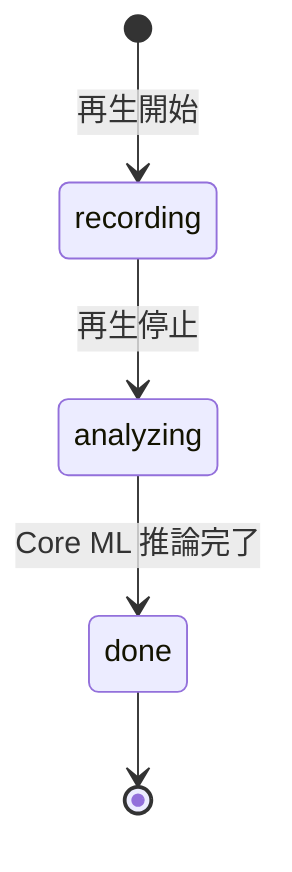

# プロジェクト用語集 (Glossary)

## 概要

HowTune プロジェクト（iOS ネイティブ）の用語定義。仕様の正は [`frontend-spec.md`](./frontend-spec.md)。

**更新日**: 2026-05-24

---

## ドメイン用語

### How（ハウ）
**定義**: 音楽の楽しみ方・聴き方の様式。「どのように」聴いているか。
**説明**: 「何を（What）聴くか」ではなく「どのように（How）聴いているか」という軸で音楽体験を表現する、HowTune のコアコンセプト。
**英語表記**: How

### Howタグ
**定義**: ユーザーの聴き方を表す短いラベル文字列。AI 対話の結果から生成され、マッチングに使う。
**使用例**: `groove`（リズムに乗る） / `bass-driven`（ベースに反応） / `chill-listener` / `drop-hype`

### Howカード
**定義**: 1回のリスニングセッションから生成される、聴き方を可視化したカード（タイトル・説明・Howタグ・代表的な反応地点）。ユーザーの確認・編集を経て確定する（自動確定しない）。

### 聴取状態（Listening State）
**定義**: 音楽を聴いているときの身体・生理状態の分類。モーション+心拍から推定する。マルチラベル（同時複数可）。

| 状態 | 英語 | 特徴 |
|------|------|------|
| ノリ | Groove | リズムに乗って規則的に揺れる |
| 高揚 | Hype | サビ・展開で急にテンションが上がる（心拍上昇を伴うことが多い）|
| チル | Chill | 穏やかにゆっくり揺れる |
| 没入 | Immersion | 集中してほぼ動かない |
| 刺さり | Hit | 一瞬に短く強く反応する |
| 余韻 | Afterglow | 盛り上がりの後、静かに浸る |

### 身体・生理反応（Body / Physiological Reaction）
**定義**: 音楽を聴いているときに検出される、頭部・本体の動きと心拍の変化。これを起点に AI が問いかけを生成する。

---

## 技術用語

### CMHeadphoneMotionManager
**定義**: AirPods 等の頭部モーション（加速度・回転速度・姿勢）を取得する iOS（Core Motion）の API。
**本プロジェクトでの用途**: AirPods 装着時の頭の動きを身体反応シグナルとして取得。
**制約**: 対応 AirPods（Pro / 3rd 以降 / Max 等）接続時のみ。シミュレータ不可、実機必須。
**関連**: `Othello/Othello/Services/HeadphoneMotionService.swift`

### Core Motion
**定義**: iPhone 本体の加速度・ジャイロを取得する iOS フレームワーク。
**本プロジェクトでの用途**: AirPods 非接続時の本体モーション取得（フォールバック）。

### HealthKit
**定義**: iOS のヘルスデータ（心拍等）を扱うフレームワーク。機微情報として明示同意が必要。
**本プロジェクトでの用途**: 対応 AirPods の心拍数・心拍変動を取得し曲中時刻に対応づける。
**制約**: 粒度が粗い場合があり、トレンド（上昇/下降/安定）として扱う。

### MusicKit
**定義**: Apple Music の楽曲再生・再生位置取得を提供する iOS フレームワーク。
**本プロジェクトでの用途**: 曲を再生位置付きで再生（DECISION-01 の有力候補）。Apple Music サブスクが必要な場合がある。

### Core ML
**定義**: iOS 端末上で機械学習モデルを実行するフレームワーク。
**本プロジェクトでの用途**: `ai-recognition/` で TensorFlow 学習したモデルを変換し、端末上で6軸スコアを推論。

### coremltools
**定義**: TensorFlow / PyTorch モデルを Core ML 形式（.mlmodel）に変換する Python ライブラリ。
**本プロジェクトでの用途**: `ai-recognition/` の学習成果物を `Othello/` に組み込む際の変換。

### MotionFrame / HeartRateSample
**定義**: 1サンプル分のモーション / 心拍データを表す Swift 型。曲中時刻に同期して記録される。

### ReactionSpan
**定義**: 検出された身体・生理反応区間（開始・終了秒 + 6軸スコア）を表す Swift 型。

### 心拍変動 (HRV)
**定義**: 心拍間隔のゆらぎ。緊張・リラックスなどの生理状態の指標。
**本プロジェクトでの用途**: 高揚・没入などの聴取状態の裏付けに利用（取得可能な場合）。

### SSE
**正式名称**: Server-Sent Events
**意味**: サーバーからクライアントへ一方向のリアルタイムストリームを送る HTTP 技術。
**本プロジェクトでの用途**: backend が Claude API の応答を iOS アプリへ逐次返す（`POST /sessions/:id/chat`）。

### TensorFlow
**定義**: Python の機械学習フレームワーク。
**本プロジェクトでの用途**: `ai-recognition/` でモーション+心拍特徴量から6軸スコアを学習。学習後 Core ML へ変換。

---

## アーキテクチャ用語

### SwiftUI / MVVM
**定義**: SwiftUI は宣言的 UI フレームワーク。MVVM は View / ViewModel / Model に責務分離するパターン。
**本プロジェクトでの適用**: View（画面）/ ViewModel（状態）/ Service（センサー・通信・推論）に分離。

### LLM プロキシ（backend）
**定義**: Claude API キーをクライアントに露出させないため、バックエンドが LLM 呼び出しを中継する構成。
**本プロジェクトでの適用**: `backend/` が Claude API を中継し、iOS アプリは backend のみを呼ぶ。

---

## ステータス・状態

### SessionStatus

| ステータス | 意味 | 遷移条件 | 次の状態 |
|----------|------|---------|---------|
| `recording` | センサー記録中 | 再生停止 | `analyzing` |
| `analyzing` | Core ML で反応区間を解析中 | 推論完了 | `done` |
| `done` | 解析完了・AI 対話可能 | — | — |

---

## データモデル用語

### User
**主要フィールド**: `id`（認証UID） / `displayName` / `howTags`（蓄積タグ）

### ListeningSession
**主要フィールド**: `id` / `userId` / `songTitle` / `motionFrames` / `heartRateSamples` / `reactions` / `status`

### HowCard
**主要フィールド**: `id` / `userId` / `sessionId` / `howTags` / `tagLabel` / `description` / `highlightSec`

---

## エラー・例外

### HowTuneError.headphoneNotConnected
**発生条件**: AirPods が未接続で頭部モーションが取得できない。
**対処**: 本体モーション（Core Motion）へフォールバック（P4 準拠）。

### HowTuneError.healthAuthorizationDenied
**発生条件**: HealthKit のヘルス権限が拒否された、または心拍非対応機種。
**対処**: 心拍機能を無効化し、モーションのみで体験を成立させる。

### HowTuneError.llmUnavailable
**発生条件**: Claude API がタイムアウト/エラー（リトライ後も失敗）。
**対処**: デフォルトの汎用質問にフォールバック。セッションは継続可能。

---

## 計算・アルゴリズム

### rhythmRegularity（リズム規則性）
**定義**: モーションのピーク間隔の一定性（0〜1）。高いほど規則的なリズム。Groove 判定に寄与。

### stillness（静止度）
**定義**: 動きのなさ（0〜1）。高いほど静止。Immersion / Afterglow 判定に寄与。

### heartRateTrend（心拍トレンド）
**定義**: 心拍数の時間変化（上昇/下降/安定）。Hype・Immersion の生理的裏付けに使う。粒度が粗いため秒単位の断定はしない。
